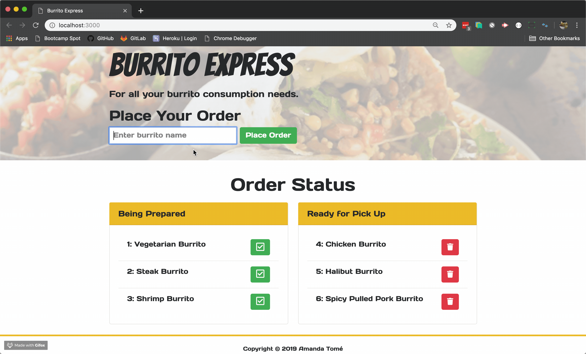

# Burrito
A burrito logger made with MySQL, Node, Express, Handlebars and ORM using MVC design patterns. 

## Website
https://aqueous-plateau-41072.herokuapp.com/

## Homework Instructions
[Homework Details](homework_instructions.md)

## Technologies and Frameworks
* HTML 5
* CSS 3
* Boostrap 4
* JavaScript
* jQuery
* REST API
    * GET
    * PUT
    * POST
    * DELETE
* Node.js
* Express
* Handlebars
* mySQL/JAWSDB
* Body Parser
* MVC
* ORM
* dotenv

## Set Up for Local Use
1. Burrito Express requires Node to be installed
2. To install node visit Node.js Website and install node for your operating system.
3. Clone the Git repository
```git clone <repo>```
4. Navigate to the directory and install the dependencies
```npm install```
5. Create a MySQL database and run the following files to set up the schema
```
db/schema.sql
db/seeds.sql
```
6. Configure the database connection settings in config/connection.js file.
7. Navigate to the repository folder and run server.js to start
```node server.js```
8. Navigate to localhost:3000 in the browser

## How It Works
* Type in your burrito choice
* Click "Place Order"
* When the order is ready, the checkmark button is clicked and the item moves to the "Ready for Pick Up" area.
* If the item is picked up it can be delete from the list.

## Future Development
* Responsive Design
* Added Menu Option for people to choose from

## Animate GIF


## License
MIT
